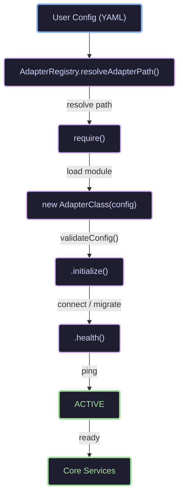
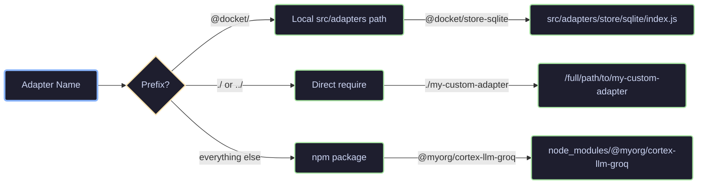
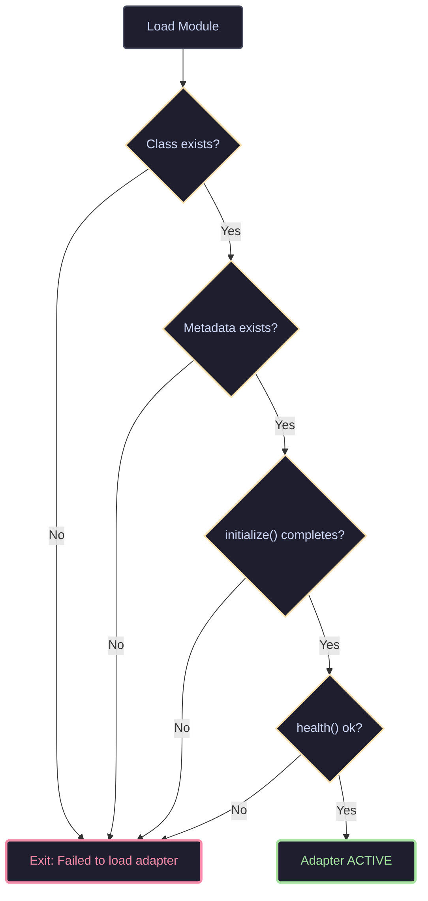

# Adapter Architecture

## Why Adapters Exist

Docket's core mission is to be **infrastructure-agnostic**. Your data, your models, your cloud. No vendor lock-in. Adapters are the boundary that makes this possible.

<LottieAnimation
  src="/lottie/adapter-swap.json"
  alt="Adapter swap animation"
  caption="Swap any adapter by changing config — the gear keeps turning regardless of which providers orbit it"
/>

The orbiting boxes represent the five adapter categories you can swap independently:
**SQLite** (Store), **Dynamo** (Store), **Ollama** (LLM), **Bedrock** (LLM), **S3** (Blob).

Without adapters, Docket would be a monolith with hardcoded dependencies:
- SQLite only
- Ollama only
- Local filesystem only

With adapters, the same core code runs on a laptop (SQLite + Ollama), on Cloudflare's edge (D1 + Workers AI), or in an AWS data center (DynamoDB + Bedrock). The core never knows which backend is active.

### The Adapter Promise

1. **Swap without rewriting** — Change three lines in `config.yaml`, restart. Zero code changes.
2. **Test in isolation** — Each adapter has its own contract test suite. Core tests never touch a real database.
3. **Develop in parallel** — A contributor can add a Qdrant adapter without understanding the ingestion pipeline.
4. **Migrate incrementally** — Use Ollama locally, Bedrock in production. Mix and match per adapter category.

## The Five Frozen Interfaces

An interface is **frozen** once it ships. Changing it requires a GitHub issue, architect review, and a version bump. This stability is what lets third-party developers publish `@docket/llm-groq` and trust it will work.

The five interfaces map to five infrastructure concerns:

| Interface | Concern | Local Default | Cloud Example |
|-----------|---------|---------------|---------------|
| `LlmAdapter` | Generate text from prompts | Ollama | AWS Bedrock |
| `EmbedderAdapter` | Turn text into vectors | Ollama | Cloudflare Workers AI |
| `StoreAdapter` | Persist memories + vectors | SQLite | DynamoDB, D1 |
| `BlobAdapter` | Store raw files | Filesystem | S3, R2 |
| `QueueAdapter` | Background job processing | In-memory | SQS, Cloudflare Queues |

### Why five categories?

Each category represents a **different scaling dimension**:

- **LLM** scales by token cost, not request count. You want to swap GPT-4 for Llama 3 to cut costs.
- **Embedder** scales by vector dimension and batch size. You want 768 dims locally, 1536 in production.
- **Store** scales by query pattern. SQLite for reads, DynamoDB for writes, Qdrant for vector search.
- **Blob** scales by size. Filesystem for `<1 GB`, S3 for `>1 TB`.
- **Queue** scales by reliability. In-memory for dev, SQS for production.

If we bundled these into one "database adapter," you couldn't scale them independently.

## Adapter Lifecycle

Every adapter goes through the same lifecycle, enforced by the `AdapterRegistry`:



### Path Resolution

The registry resolves adapter names using three strategies:



This means you can develop an adapter inside the repo, then publish it to npm without changing the config structure.

### Validation Gate

Before initialization, the registry verifies three things:



If any gate fails, the server exits with a clear error:

```
Failed to initialize adapters: Failed to load adapter @docket/llm-ollama:
Ollama unreachable at http://localhost:11434: fetch failed
Run `npm run doctor` to check prerequisites.
```

## Anatomy of an Adapter

Every adapter follows the same skeleton. Here is the Ollama LLM adapter annotated:

```javascript
const { LlmAdapter } = require('../../../core/interfaces/llm-adapter');

class OllamaLlmAdapter extends LlmAdapter {
  // ─── 1. CONFIG ───────────────────────────────────────────
  constructor(config) {
    super(config);              // validates config is an object
    this.baseUrl = this.config.baseUrl || 'http://localhost:11434';
    this.model = this.config.model || 'llama3.2';
    this.timeout = this.config.timeout || 30000;
  }

  // Override if you need stricter validation
  validateConfig(config) {
    const validated = super.validateConfig(config);
    if (!validated.baseUrl) {
      throw new Error('baseUrl is required');
    }
    return validated;
  }

  // ─── 2. INITIALIZATION ───────────────────────────────────
  async initialize() {
    // Warm-up: verify the service is reachable
    const health = await this.health();
    if (!health.ok) {
      throw new Error(`Ollama unreachable at ${this.baseUrl}: ${health.error}`);
    }
  }

  // ─── 3. BUSINESS METHODS ─────────────────────────────────
  async chat(messages, options = {}) {
    const url = `${this.baseUrl}/api/chat`;
    const body = { /* ... */ };

    const controller = new AbortController();
    const timeoutId = setTimeout(() => controller.abort(), this.timeout);

    try {
      const res = await fetch(url, {
        method: 'POST',
        headers: { 'Content-Type': 'application/json' },
        body: JSON.stringify(body),
        signal: controller.signal
      });
      clearTimeout(timeoutId);

      if (!res.ok) {
        const text = await res.text();
        throw new Error(`Ollama HTTP ${res.status}: ${text}`);
      }

      return this.parseResponse(await res.json());
    } catch (err) {
      clearTimeout(timeoutId);
      if (err.name === 'AbortError') {
        throw new Error(`Ollama request timed out after ${this.timeout}ms`);
      }
      throw err;
    }
  }

  parseResponse(response) {
    return {
      content: (response.message?.content || '').trim(),
      usage: { prompt: 0, completion: 0, total: 0 },
      finishReason: 'stop',
      model: response.model || this.model
    };
  }

  // ─── 4. HEALTH ───────────────────────────────────────────
  async health() {
    const start = Date.now();
    try {
      const res = await fetch(`${this.baseUrl}/api/tags`, {
        signal: AbortSignal.timeout(5000)
      });
      if (!res.ok) throw new Error(`HTTP ${res.status}`);
      return { ok: true, latency: Date.now() - start };
    } catch (err) {
      return { ok: false, latency: Date.now() - start, error: err.message };
    }
  }

  // ─── 5. METADATA ─────────────────────────────────────────
  static get metadata() {
    return {
      name: 'ollama-llm',
      version: '0.1.0',
      capabilities: ['chat'],
      cortexCompatibility: '>=0.1.0 <0.3.0'
    };
  }
}
```

### The Six Sections Every Adapter Has

| Section | Purpose | Example |
|---------|---------|---------|
| **Config** | Store and validate settings | `baseUrl`, `apiKey`, `model` |
| **Initialize** | One-time setup | Connect to DB, verify credentials, run migrations |
| **Business methods** | The actual work | `chat()`, `embed()`, `createMemory()`, `put()` |
| **Health** | Cheap ping | `GET /api/tags`, `SELECT 1`, `ListTables` |
| **Metadata** | Discovery | Name, version, capabilities, compatibility |
| **Error handling** | Consistent failures | Timeout, retry, clear messages |

## Error Handling Patterns

Adapters are the system boundary. When they fail, the user needs to know **why** and **what to do**.

### Timeout Pattern

Every network adapter uses the same timeout pattern:

```javascript
const controller = new AbortController();
const timeoutId = setTimeout(() => controller.abort(), this.timeout);
try {
  const res = await fetch(url, { signal: controller.signal });
  // ...
} catch (err) {
  if (err.name === 'AbortError') {
    throw new Error(`Request timed out after ${this.timeout}ms`);
  }
  throw err;
} finally {
  clearTimeout(timeoutId);
}
```

This guarantees that a hanging request does not freeze the ingestion pipeline.

### Fail Fast in Initialize

If an adapter cannot reach its backend, it throws during `initialize()`. The server refuses to start. This is intentional: a Docket with a broken database is worse than no Docket at all.

```javascript
async initialize() {
  const health = await this.health();
  if (!health.ok) {
    throw new Error(`Backend unreachable: ${health.error}`);
  }
}
```

### Health Returns, Never Throws

The `health()` method itself never throws. It always returns `{ ok, latency, error? }`. This lets the control plane aggregate health from all adapters without try/catch noise.

```javascript
async health() {
  const start = Date.now();
  try {
    await this.ping();
    return { ok: true, latency: Date.now() - start };
  } catch (err) {
    return { ok: false, latency: Date.now() - start, error: err.message };
  }
}
```

## Configuration Patterns

Adapters receive their config from `config.yaml` via the registry. The shape is always:

```yaml
adapters:
  <category>:
    default: "<provider-name>"
    providers:
      <provider-name>:
        adapter: "<package-name>"
        config:
          <key>: <value>
```

### Environment Variable Interpolation

Config values support `${VAR}` and `${VAR:-default}`:

```yaml
config:
  apiKey: "${OPENAI_API_KEY}"           # throws if missing
  baseUrl: "${OLLAMA_URL:-http://localhost:11434}"  # uses default
```

This lets you commit `config.yaml` to version control without secrets.

### CORTEX_* Environment Overrides

Any env var starting with `CORTEX_` overrides config automatically:

```bash
CORTEX_ADAPTERS_LLM_DEFAULT=openai
CORTEX_ADAPTERS_STORE_DEFAULT=dynamodb
```

This is useful for CI/CD and container deployments where editing YAML is impractical.

## Cloud vs Local: Adapter Design Differences

Cloud adapters face constraints that local adapters do not. The design handles both transparently.

| Concern | Local Adapter | Cloud Adapter |
|---------|---------------|---------------|
| **Connection** | Open file or local HTTP | Authenticated API over TLS |
| **Latency** | `<1 ms` (filesystem), `~10 ms` (localhost HTTP) | 20-200 ms depending on region |
| **Cost** | Free | Per-request or per-token |
| **Reliability** | Machine stays up | Networks fail, rate limits hit |
| **Schema** | Migrations run automatically | Schemaless (DynamoDB) or managed (D1) |
| **Vector search** | sqlite-vec native | In-memory cosine fallback |

### The Vector Search Problem

Not every database supports native vector search. SQLite has `sqlite-vec`. DynamoDB and D1 do not.

The solution: **adapter-local fallback**.

```javascript
// DynamoDB adapter
async vectorSearch(embedding, options) {
  // 1. Fetch all vectors from DynamoDB
  const scanResult = await this.scanForEmbeddings();

  // 2. Compute cosine similarity in memory
  const results = [];
  for (const item of scanResult.Items) {
    const score = this._cosineSimilarity(embedding, item.embedding);
    if (score >= options.threshold) {
      results.push({ memory: item, score });
    }
  }

  // 3. Sort and return top-k
  results.sort((a, b) => b.score - a.score);
  return results.slice(0, options.limit || 10);
}
```

This is slower than native vector search but keeps the interface contract intact. When Qdrant or pgvector is available, swap the adapter and vector search becomes native again.

## How Core Services Use Adapters

Core services never import an adapter directly. They receive adapter instances at runtime.

```javascript
// Bad — hardcoded dependency
const { SQLiteStoreAdapter } = require('../adapters/store/sqlite');

// Good — injected dependency
class QueryService {
  constructor({ store, embedder, llm }) {
    this.store = store;
    this.embedder = embedder;
    this.llm = llm;
  }

  async query(question) {
    const embedding = await this.embedder.embed(question);
    const candidates = await this.store.vectorSearch(embedding);
    const answer = await this.llm.chat(buildPrompt(question, candidates));
    return answer;
  }
}
```

This inversion of control means `QueryService` works unchanged whether `store` is SQLite, DynamoDB, or D1.

## Testing Adapters

Every adapter has two test layers:

### 1. Unit Tests (Mock Backend)

Test the adapter's logic without hitting a real service:

```javascript
describe('S3BlobAdapter', () => {
  it('resolves keys correctly', () => {
    const adapter = new S3BlobAdapter({ bucket: 'test', region: 'us-east-1' });
    // Test internal helper methods
  });
});
```

### 2. Contract Tests (Real Backend)

Test that the adapter satisfies the interface contract:

```javascript
describe('StoreAdapter Contract', () => {
  let store;

  beforeAll(async () => {
    store = new SQLiteStoreAdapter({ path: ':memory:' });
    await store.initialize();
  });

  it('creates and retrieves a memory', async () => {
    const created = await store.createMemory({ rawRef: 'test', contentType: 'text/plain' });
    const retrieved = await store.getMemory(created.id);
    expect(retrieved.rawRef).toBe('test');
  });

  it('performs vector search', async () => {
    const results = await store.vectorSearch([0.1, 0.2, 0.3], { limit: 5 });
    expect(Array.isArray(results)).toBe(true);
  });
});
```

Contract tests live in `tests/integration/adapter-contracts/`. A new adapter must pass its category's contract tests before it can be merged.

## Adding a New Adapter: Checklist

1. **Create directory**: `src/adapters/<category>/<name>/`
2. **Implement class**: Extend the interface, implement all abstract methods
3. **Add metadata**: `static get metadata()`
4. **Add health check**: Override if you have a cheaper ping than the default
5. **Add config example**: Update `config/defaults.yaml`
6. **Write unit tests**: Mock external calls
7. **Write contract tests**: Run against a real instance
8. **Run lint**: `npm run lint`
9. **Update docs**: Add to provider-specific onboarding if applicable

## Adapter Registry Deep Dive

The `AdapterRegistry` is the single source of truth for loaded adapters.

```javascript
const registry = new AdapterRegistry();

// Initialize all 5 adapters from config
const adapters = await registry.initializeFromConfig(config);
// adapters = { llm, embedder, store, blob, queue }

// Get a specific adapter later
const store = registry.get('store');

// Health check all adapters at once
const health = await registry.healthCheck();
// health = { llm: { ok: true }, store: { ok: false, error: '...' } }
```

### Why a registry instead of direct imports?

1. **Lazy loading** — Adapters are loaded only when needed.
2. **Centralized health** — One call checks everything.
3. **Plugin support** — The control plane can register/unregister adapters at runtime.
4. **Testability** — Tests inject mock registries without modifying source code.

## Summary

Adapters are Docket's **portability layer**. They turn a hardcoded application into a configurable platform.

- **Five frozen interfaces** separate concerns cleanly.
- **Identical lifecycles** make every adapter predictable.
- **Path resolution** supports local, npm, and relative sources.
- **Fail-fast initialization** prevents silent misconfiguration.
- **Health checks** give operators visibility.
- **Contract tests** guarantee compatibility without coupling.

The result: swap your entire infrastructure by changing `config.yaml`.
