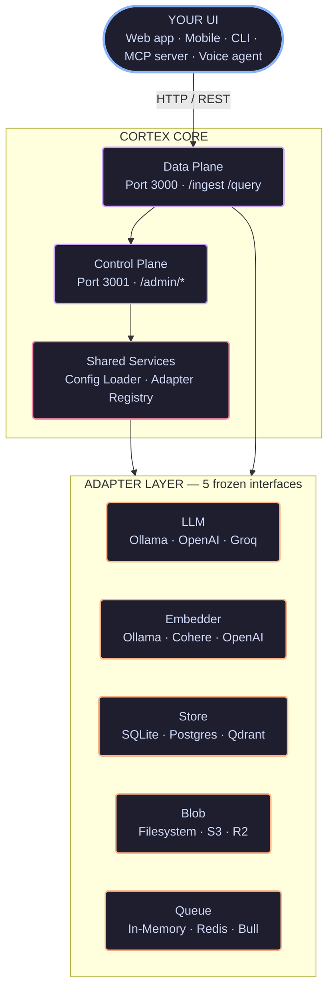
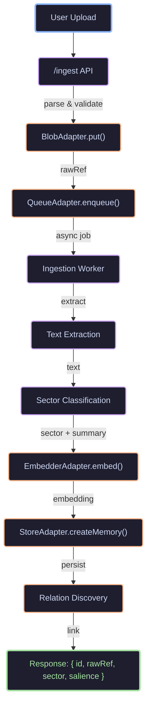
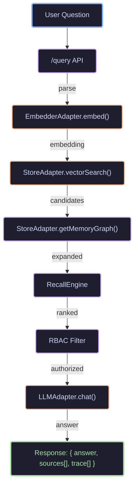
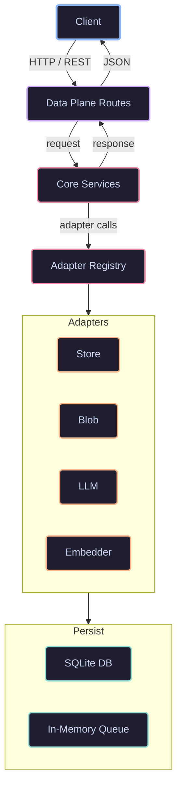
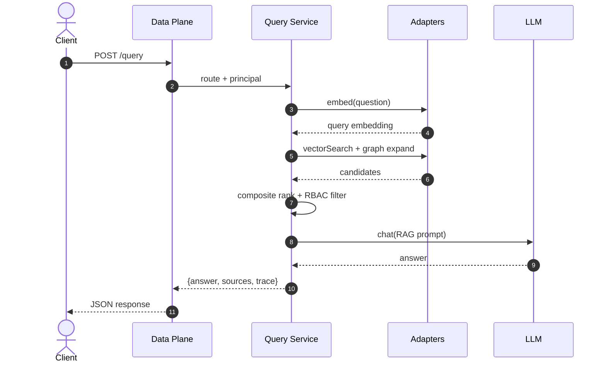

# System Overview

Cortex is a modular **Second Brain as a Service**. At its heart are five swappable adapters wrapped by a rich cognitive memory layer. This page shows how the pieces fit together.

## High-level layout



## Ingestion pipeline

When you POST a file to `/ingest`, Cortex runs it through a multi-stage pipeline.

<LottieAnimation
  src="/lottie/data-pipeline.json"
  alt="Data flowing through ingestion stages"
  caption="Animated view of data moving from ingest through embed to store"
/>

The four stages shown left-to-right are **Ingest** → **Embed** → **Store** → **Query**.

The pipeline steps are:



## Query pipeline

When you POST a question to `/query`, Cortex performs composite recall.

<LottieAnimation
  src="/lottie/query-pipeline.json"
  alt="Query pipeline animation"
  caption="Search pulses outward and results flow back in ranked order"
/>

The magnifying glass on the left represents the **query** step; the ranked bars flowing to the right are the **retrieval results**.

The recall steps are:



## Memory model (rich mode)

In **rich mode**, memories are not flat documents. They are cognitive objects with relations.

<LottieAnimation
  src="/lottie/memory-nodes.json"
  alt="Memory nodes orbiting a central hub"
  caption="Memories form a graph — the central hub rotates while related nodes orbit at different distances"
/>

The central hub is the **memory core**; each orbiting dot is a related memory at a different distance (relevance).

A rich memory record looks like this:

```
┌─────────────────────────────────────────────────────────────┐
│                      Memory Record                          │
├─────────────────────────────────────────────────────────────┤
│  id: mem_abc123                                             │
│  rawRef: blobs/mem_abc123/raw.jpg                           │
│  contentType: image/jpeg                                    │
├─────────────────────────────────────────────────────────────┤
│  extractedText: "A red bicycle on a mountain trail"         │
│  summary: "Mountain biking photo from Colorado trip"        │
│  embedding: [0.12, -0.34, ...]  ← 768-dim float32          │
├─────────────────────────────────────────────────────────────┤
│  sector: "episodic"                                         │
│  salience: 0.87  ← decays over time                         │
│  validFrom: 2026-05-01                                      │
│  validTo: null  ← null = indefinite                         │
│  parentId: null  ← for threading / versioning               │
├─────────────────────────────────────────────────────────────┤
│  accessPolicy: "owner-only"                                 │
│  metadata: { source: "iphone", gps: "39.5,-106.1" }        │
├─────────────────────────────────────────────────────────────┤
│  createdAt: 2026-05-10T09:00:00Z                            │
│  updatedAt: 2026-05-10T09:00:00Z                            │
└─────────────────────────────────────────────────────────────┘
                              │
                              │ relations
                              ▼
┌─────────────────────────────────────────────────────────────┐
│  Source: mem_abc123  ──caused──▶  Target: mem_def456        │
│  type: "caused"    confidence: 0.92   metadata: {}          │
│                                                             │
│  Source: mem_ghi789  ──similar──▶  Target: mem_abc123       │
│  type: "similar"   confidence: 0.78   metadata: {}          │
└─────────────────────────────────────────────────────────────┘
```

## Data flow diagram



## Control plane

The control plane is Cortex's brain — it orchestrates adapters, enforces policies, and ensures every component is healthy.

<LottieAnimation
  src="/lottie/control-plane.json"
  alt="Control plane shield with status indicators"
  caption="The control plane validates configuration and monitors adapter health"
/>

The shield is the **control plane**; the four blinking indicators are adapter health checks (LLM, Store, Blob, Queue).

## Component responsibilities

| Component | Owns | Does NOT own |
|-----------|------|--------------|
| **Control Plane** | Adapter registry, config, RBAC policies, metrics, plugin lifecycle | Business logic, memory content, vector math |
| **Data Plane** | HTTP routes, request validation, auth principal extraction | Adapter implementations, persistence details |
| **Core Services** | Ingestion pipeline, query pipeline, recall scoring, decay logic | HTTP transport, database internals |
| **Adapter Layer** | Interface implementations, vendor API calls, connection management | Pipeline orchestration, scoring algorithms |
| **Shared Persistence** | Raw data, embeddings, relations, jobs, config tables | Business rules, access control logic |

## Request lifecycle



## Diagrams in this documentation

Cortex docs support three diagram formats.

**Mermaid** is used for flowcharts, sequence diagrams, and architectural overviews that should stay in sync with code changes. Write them as fenced code blocks with the `mermaid` language tag.

**Excalidraw** is used for richer illustrations. Export an SVG from [Excalidraw](https://excalidraw.com) and place it in `docs/public/diagrams/`. The docs site renders it with a lightweight component that loads the static asset — no heavy editor runtime is bundled.

**Lottie** is used for motion animations that explain temporal concepts — data flowing through pipelines, adapter swaps, memory decay over time, or onboarding progress. Place a Lottie JSON in `docs/public/lottie/` and embed it with the `<LottieAnimation>` component. Lottie files are typically 10–100 KB of vector data, so they scale infinitely and load faster than video.

```tsx
<LottieAnimation
  src="/lottie/data-pipeline.json"
  alt="Data pipeline animation"
  caption="Data flows from upload through extraction to storage"
/>
```
